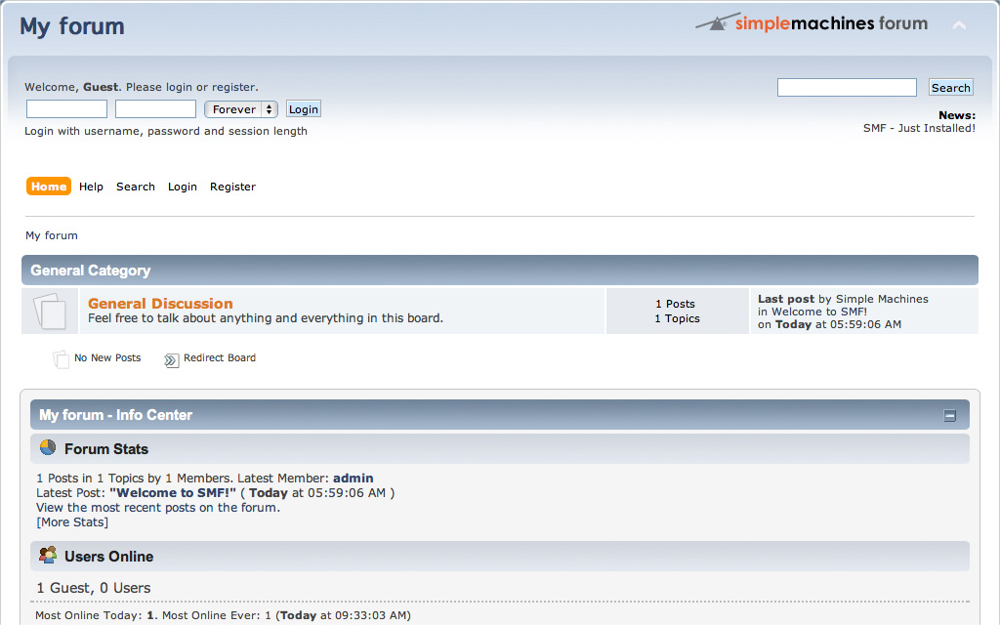
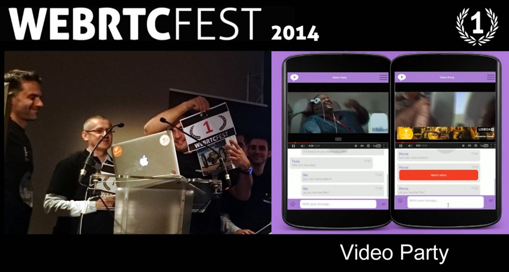
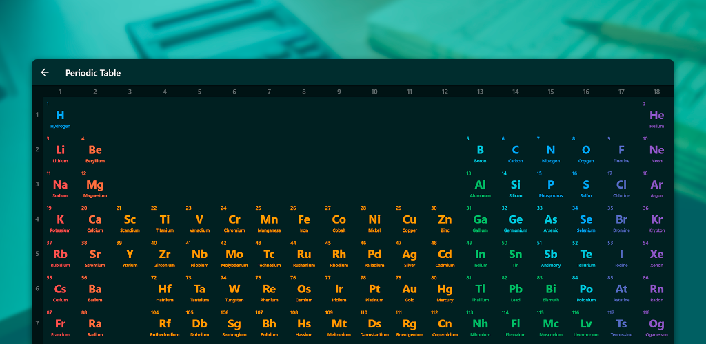
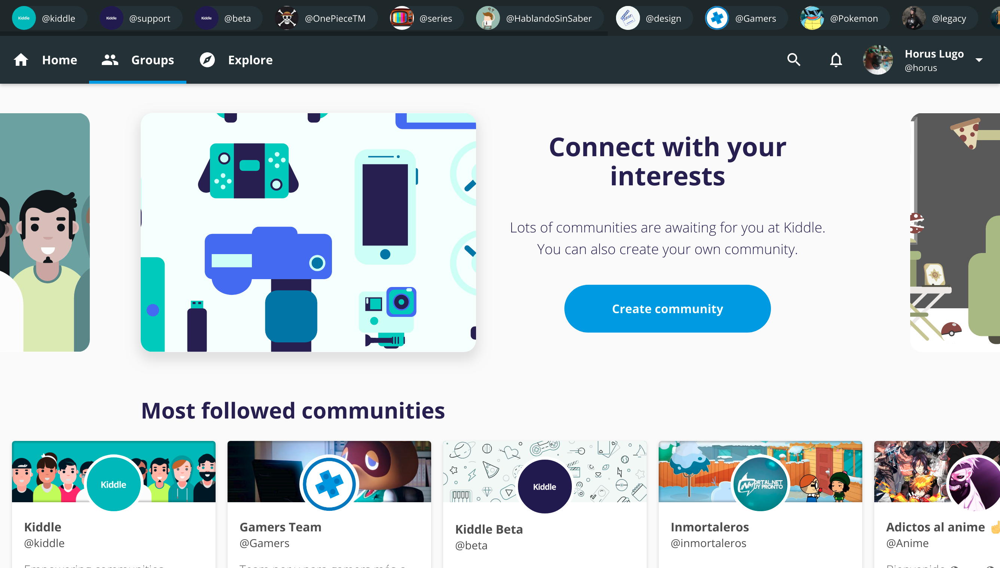

Software development has been my passion for years. I've been always building stuff with the purpose of helping others to learn, build communities or even just for fun. I'm eager to learn new technologies and use them to make great products that maybe, one day, will be used by millions of
people.

I started around 2009, with the purpose of building web pages related to browser games. At that time, I was 10 years old and it was all trial and error, and without knowing it, I learned HTML, CSS and enough PHP to make modifications on a forum CMS. It wasn't until 2014 that I made contact with the Javascript ecosystem. 

That year, I learned some Javascript and jQuery. That led me to build basic apps, games, and even to win a WebRTC Hackathon. In the following years, I focused on learning more about developing using vanilla Javascript and then moved onto frameworks and libraries such as Angular and React.

Over the years, I've developed lots of things and the one I'm definitely most proud of is [Atom - Periodic Table & Tests](https://atom.horuslugo.com). I built it with the purpose of studying for some chemistry exams back in high school, but as soon as I published it, more students found it useful to take off with their chemistry classes. Back in March, I decided to rebuild the app and [open source](https://github.com/HorusGoul/atom-pwa) it on my GitHub profile, so others can check out the code or even contribute to the project!

Another project that deserves to be mentioned is the one I'm currently working on and has made me the great developer I'm today, [Kiddle](https://kiddle.xyz). We attempt to bring people a way to connect with their interests by offering a platform with tools to build and discover communities. As the only developer of the project, I've faced a lot of challenges that required me to step up my game in areas such as performance in browsers or UI/UX design. Some technologies that are currently in use are Typescript, React, Redux, Node.js, and PostgreSQL.

Projects apart, I'm interested in learning more about topics like functional programming, testing, or usability.

Besides my professional career, there are other things that I like such as playing ping pong, reading blogs about science or going out with my friends. My favorite music genre is electronic, more specifically, Trance, followed by Progressive House. To finish this introduction about myself, I think it's needed to say that I'm a cat person.

And that would be me, born in 1998, currently living in Seville, improving every day, as a person, and as a professional Software Developer.

  

