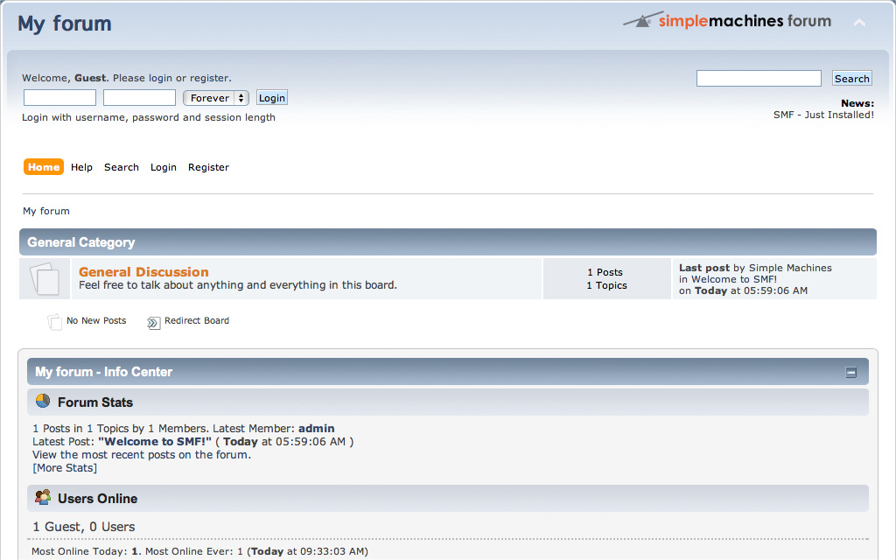
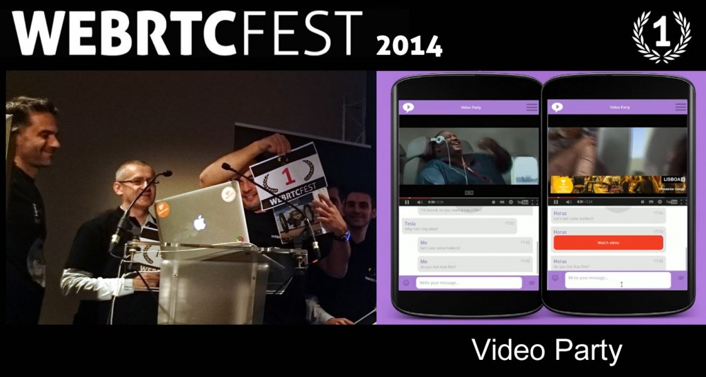
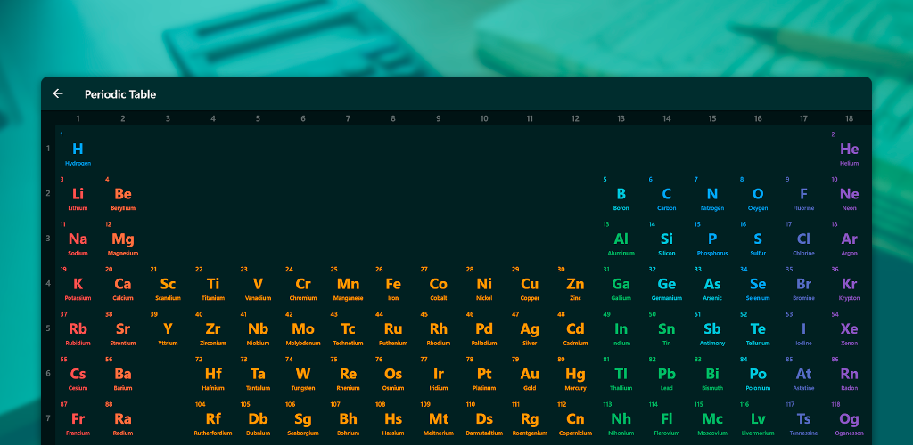
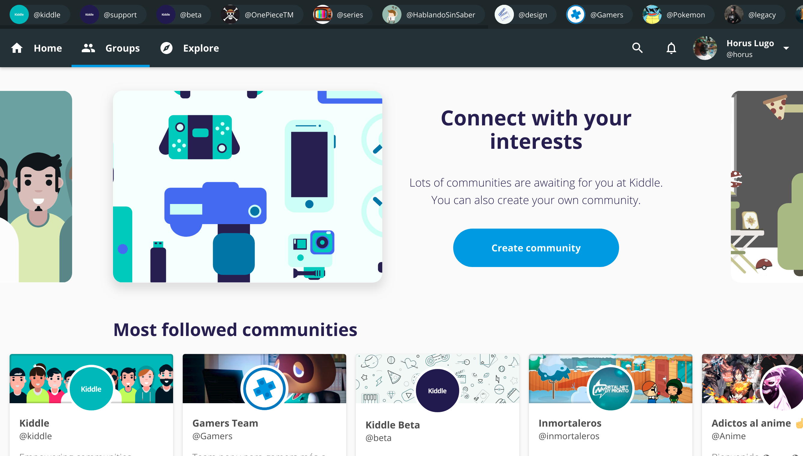

El desarrollo de software ha sido mi pasión desde hace años. Siempre he estado creando cosas con el propósito de que otros puedan aprender, crear comunidades o incluso para divertirme. Me encanta aprender y usar nuevas tecnologías para poder lanzar productos que quizá, algún día, sean utilizados por millones de personas.

Empecé sobre 2009, con el objetivo de crear páginas sobre juegos de navegador. En aquella época, tenía 10 años, todo era prueba y error, y, casi sin darme cuenta, aprendí HTML, CSS y el suficiente PHP como para hacer modificaciones en una CMS de foros. No fue hasta 2014 donde conocí el ecosistema de Javascript.

Ese año aprendí algo de Javascript y de jQuery, lo que me llevó a crear aplicaciones, juegos, e incluso a ganar un Hackathon de WebRTC. En los años siguientes, me centré en aprender más sobre Javascript vanilla, y después pasé a utilizar frameworks y librerías como Angular y React.

Con los años, he desarrollado un montón de cosas, pero de la que más orgulloso estoy es [Atom - Tabla Periódica & Tests](https://atom.horuslugo.com). Esta aplicación la creé porque necesitaba estudiar para unos exámenes de química cuando estaba en bachillerato, pero, cuando la publiqué, más estudiantes la encontraron útil y empezaron a utilizarla para dar un empujón al inicio de sus clases de química. En Marzo de 2018, decidí reconstruir la aplicación, y hacerla [open source](https://github.com/HorusGoul/atom-pwa) publicandola en mi perfil de GitHub para que otros puedan revisar el código o incluso contribuir al proyecto.

Otro proyecto que merece ser mencionado, y en el cual aún estoy trabajando, [Kiddle](https://kiddle.xyz). Con Kiddle, queremos ofrecer a la gente una forma de conectar con sus intereses ofreciéndoles una plataforma con las herramientas para crear y descubrir comunidades. Como único desarrollador del proyecto, me he encontrado con montones de retos gracias a los cuales me he visto obligado a mejorar en áreas como rendimiento en los navegadores, o diseño UI/UX. A día de hoy, me considero un buen desarrollador gracias a este proyecto. Algunas de las tecnologías que están actualmente en uso son: Typescript, React, Redux, Node.js y PostgreSQL.

Proyectos aparte, estoy interesado en aprender más sobre temas como programación funcional, testing, o usabilidad.

Además de mi carrera profesional, hay otras cosas que me gustan mucho como jugar ping pong, leer blogs sobre ciencia o salir con mis amigos. Mi género de música favorito es electrónica, más específicamente, Trance, seguido del Progressive House. Para acabar esta introducción sobre mí, creo que es necesario decir que me gustan mas los gatos que los perros.

Y todo esto sería yo, nací en 1998, actualmente viviendo en Sevilla, mejorando cada día como persona y como Desarrollador de Sofware profesional.

  

