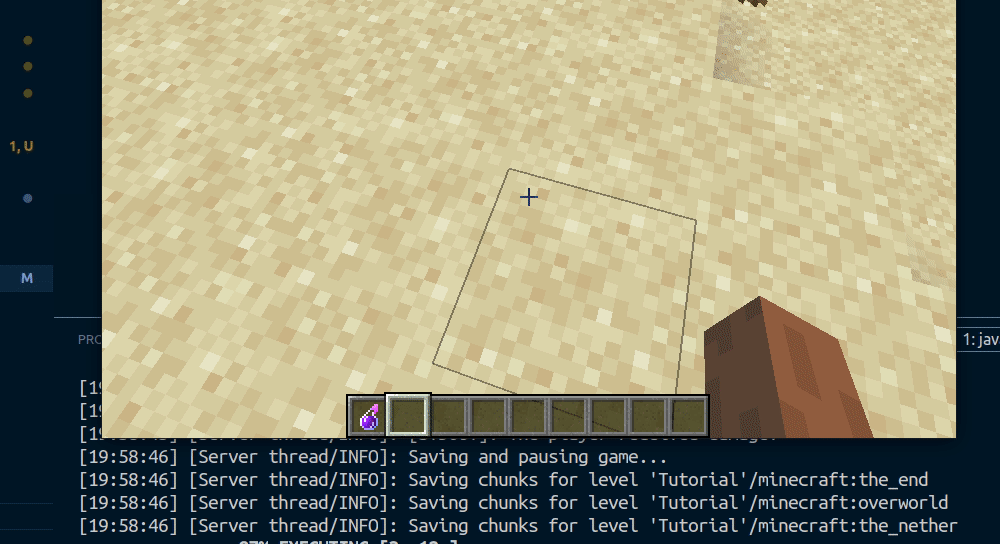
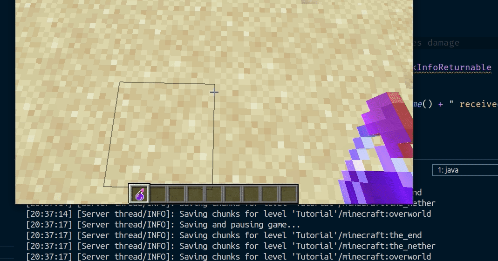
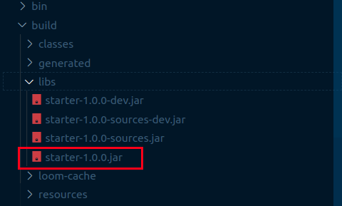

A few weeks ago, YouTube recommended me a Minecraft video from [Dream's Channel](https://www.youtube.com/user/DreamTraps) in which he was trying to beat the game while his friend George attempted to stop him. That video was really fun and got me to explore more of their content.

Right now, there's a bunch of people recording and uploading Minecraft videos to YouTube, but these two found a way to make their content different. Basically, **they build their own plugins to change the rules of the game** and then they record themselves attempting to beat the modified game. All I can say is that I love their content, and it's awesome to see what you can accomplish with the power of code.

A few days later, I had an idea to develop a Minecraft mod and thought _Why not? It will be fun!_

## Selecting the tools

Just like in Minecraft, we need some tools but in this case, they will help us in the creation process of our first mod.

Multiple tools help you build Minecraft mods, and I chose [Fabric](https://fabricmc.net) because one of the mods that I usually play with was built with it.

Minecraft uses Java and so does Fabric, which means we also need to have the Java Development Kit or JDK installed. To be more specific, we need the JDK 8 to be able to compile our mod. [You can download it on this page](https://adoptopenjdk.net/).

Last but not least, we need to pick a code editor, in this case, I chose [Visual Studio Code](https://code.visualstudio.com/) because it's my favorite editor. Nevertheless, you can use whatever editor you like for this guide, as most of the steps will be performed in the CLI.

## Setting up the project

For this guide, we will be using a starter to move quickly into actually building our first mod. Let's go through the following steps:

### 1. Clone / Download the repository

If you use Git, just clone the repo:

```bash
$ git clone https://github.com/HorusGoul/fabric-mod-starter.git
```

Otherwise, [click this link to download it](https://github.com/HorusGoul/fabric-mod-starter/archive/starting-point.zip).

### 2. Open the project folder with your code editor

Using Visual Studio Code:

```bash
$ code fabric-mod-starter
```

### 3. Open a terminal inside the project folder and run the client

```bash
$ cd fabric-mod-starter
$ ./gradlew runClient
```

**NOTE:** In Windows, you'll need to run `.\gradlew.bat runClient` instead.

### 4. Check that everything is working

A Minecraft instance should be running now on your computer, and the console should have printed these two lines alongside others:

```
...

[main/INFO]: [STDOUT]: Hello Fabric world!

...

[main/INFO]: [STDOUT]: This line is printed by an example mod mixin!

...
```

If that's not the case for you, recheck everything and if nothing seems to work, leave a comment or send me a PM and I'll try to help you.

---

## Getting to know the project

At the moment, we can already get our hands dirty by starting to code, but let's get familiarized with some of the files.

### `gradle.properties`

In this file, we can configure some values that will be used when building our mod. For example, we can change the Minecraft version, the fabric loader version, the mod version and other properties that we may need to change if we want to use new features of Fabric or Minecraft.

```properties
# Done to increase the memory available to gradle.
org.gradle.jvmargs=-Xmx1G

# Fabric Properties
    # check these on https://fabricmc.net/use
    minecraft_version=1.15.1
    yarn_mappings=1.15.1+build.1
    loader_version=0.7.3+build.176

# Mod Properties
    mod_version = 1.0.0
    maven_group = starter
    archives_base_name = starter

# Dependencies
    # currently not on the main fabric site, check on the maven: https://maven.fabricmc.net/net/fabricmc/fabric-api/fabric-api
    fabric_version=0.4.25+build.282-1.15
```

### `src/main`

Inside the `src` folder, we will be able to find another folder called `main`. That's where the code and resources of our mod are located.

#### `src/main/java`

All the Java code is located inside this folder. There we can find a package called `starter` which contains two items: the `StarterMod.java` file and the `mixin` package.

We can find the file `StarterMixin.java` inside the `mixin` package.

> **TIP:** If you're using Visual Studio Code, I recommend you to install the [Java Extension Pack](https://marketplace.visualstudio.com/items?itemName=vscjava.vscode-java-pack). It will power your editor with a bunch of utilities to make Java development easier.

`StarterMod.java`

This is the main entry point of our mod, as we can see, it belongs to the `starter` package and implements the `onInitialize()` method, which simply prints `Hello Fabric world!` to the console.

```java
package starter;

import net.fabricmc.api.ModInitializer;

public class StarterMod implements ModInitializer {
  @Override
  public void onInitialize() {
    // This code runs as soon as Minecraft is in a mod-load-ready state.
    // However, some things (like resources) may still be uninitialized.
    // Proceed with mild caution.

    System.out.println("Hello Fabric world!");
  }
}
```

`StarterMixin.java`

This class belongs to the `starter.mixin` package. Our mod will be really small so we shouldn't worry a lot about the file structure of our project. Let's just assume that all mixins will be located inside the `starter.mixin` package.

**And what are mixins?**

Mixins are in charge of injecting code into existing classes of the game. For example, in `StarterMixin.java`, we are injecting a method at the beginning (HEAD) of the `init()` method that is implemented in the `TitleScreen` class from Minecraft.

Now, if we load this mixin, once Minecraft calls the `init()` method of `TitleScreen`, our method that includes the `System.out.println("This line is printed by an example mod mixin!");` will also be called!

That's part of the magic of mixins, and this is just the tip of the iceberg, for now, this is all we need to build our mod. If you want more in-depth knowledge you should go check the [Mixin docs](https://github.com/SpongePowered/Mixin/wiki).

```java
package starter.mixin;

import net.minecraft.client.gui.screen.TitleScreen;
import org.spongepowered.asm.mixin.Mixin;
import org.spongepowered.asm.mixin.injection.At;
import org.spongepowered.asm.mixin.injection.Inject;
import org.spongepowered.asm.mixin.injection.callback.CallbackInfo;

@Mixin(TitleScreen.class)
public class StarterMixin {
  @Inject(at = @At("HEAD"), method = "init()V")
  private void init(CallbackInfo info) {
    System.out.println("This line is printed by an example mod mixin!");
  }
}
```

#### `src/main/resources`

Inside the `resources` folder, we can find the `assets` folder, which right now only contains the icon for our mod. Besides that folder, there are two JSON files:

`fabric.mod.json`

For this file, I recommend you to go into the [Fabric docs about fabric.mod.json](https://fabricmc.net/wiki/documentation:fabric_mod_json) and read about every field defined inside the file of our project.

If you prefer to read the docs later, just take a look at the `entrypoints` and `mixins` properties.

I bet you can already see a connection here. In the `entrypoints` is where we are telling Fabric which one of our Java classes should act as the main entry point of our mod.

And then, there's the `mixins` property, where we simply tell Fabric the location of any Mixin configuration file we want to include in our mod. In this case, we only have one, `starter.mixins.json`.

```json
{
  "schemaVersion": 1,
  "id": "starter",
  "version": "${version}",

  "name": "Starter Mod",
  "description": "Describe your mod!",
  "authors": ["Your Name"],
  "contact": {
    "homepage": "https://horuslugo.com",
    "sources": "https://github.com/HorusGoul/fabric-mod-starter"
  },
  "license": "MIT",
  "icon": "assets/starter/icon.png",

  "environment": "*",

  "entrypoints": {
    "main": ["starter.StarterMod"]
  },

  "mixins": ["starter.mixins.json"],

  "depends": {
    "fabricloader": ">=0.7.3",
    "minecraft": "1.15.x"
  },

  "suggests": {
    "flamingo": "*"
  }
}
```

`starter.mixins.json`

Remember our StarterMixin class? This is how we can tell the toolchain the mixins that we want to include in our mod. The `package` property is where we define the Java package where the mixins are located, and inside the `mixins` array is where we can put all the mixin classes that we want to include to the game.

Alongside `mixins` there are two other properties that allow us to specify the environment where we want to load some mixins. Those properties are `server` and `client`, but in this case, we're not using them.

This file follows the specification defined in the [Mixin configuration files section](https://github.com/SpongePowered/Mixin/wiki/Introduction-to-Mixins---The-Mixin-Environment#mixin-configuration-files) of the Mixin Docs. Just the same as before, I recommend you to go to the docs and learn more about this file 😄

```json
{
  "required": true,
  "package": "starter.mixin",
  "compatibilityLevel": "JAVA_8",
  "mixins": ["StarterMixin"],
  "injectors": {
    "defaultRequire": 1
  }
}
```

---

## Let's build our mod!

Now that we are familiar with the project, let's gets our hands dirty and create our mod!

In this case, the mod will simply alter one mechanic of the game: **receiving damage**. We'll make it so whenever a player receives damage, it will switch its position and inventory with another player in the server.

For this, we're going to need a mixin that injects code in the `PlayerEntity` class, to be more specific, just before the end of the `damage()` method.

### Detecting when players receive damage

Let's create this new mixin in the `starter.mixin` package with the name `SwitchPlayerEntityMixin.java`:

```java
package starter.mixin;

import org.spongepowered.asm.mixin.Mixin;
import org.spongepowered.asm.mixin.injection.At;
import org.spongepowered.asm.mixin.injection.Inject;
import org.spongepowered.asm.mixin.injection.callback.CallbackInfoReturnable;

import net.minecraft.entity.damage.DamageSource;
import net.minecraft.entity.player.PlayerEntity;

@Mixin(PlayerEntity.class)
public class SwitchPlayerEntityMixin {

  @Inject(at = @At("RETURN"), method = "damage")
  private void onDamage(DamageSource source, float amount, CallbackInfoReturnable info) {
    System.out.println("The player received damage!");
  }
}
```

Don't forget to add it to the `starter.mixins.json` file:

```json
{
  "required": true,
  "package": "starter.mixin",
  "compatibilityLevel": "JAVA_8",
  "mixins": ["StarterMixin", "SwitchPlayerEntityMixin"],
  "injectors": {
    "defaultRequire": 1
  }
}
```

Now execute the command `./gradlew runClient` in the console, launch a Minecraft world in creative mode, grab some instant damage potions and try to get hurt.



Just like in the GIF, you should be able to see a new line pop up in the console every time the player gets hurt, and that means we can continue to the explanation of what is going on.

Take a look to the mixin code, our purpose was to get the method `onDamage` executed at the end of the method `damage`, that's why we are using the string `RETURN` instead of `HEAD`. Also, we are going to need the damage `source` and the `amount` of damage inflicted. The last parameter, `info` is required by the Mixin framework.

Both the `source` and `amount` are parameters that the original `damage` method receives, and that's the reason we can just use them in our method.

---

### Accessing the current player

Right now, the mod is just printing a line every time a player gets hurt, our next objective is accessing the player instance.

We must first remember that the `onDamage` method is inside of a `PlayerEntity` instance. We can take advantage of that and simply use `this` to access the instance properties and methods. The problem comes when the compiler yells at us because it thinks that we're an instance of `SwitchPlayerEntityMixin`.

We don't have a way to tell the compiler that this method is being executed inside of another type of class, so we can use this trick:

```java
PlayerEntity self = (PlayerEntity) (Object) this;
```

With this, we are telling the compiler that `this` is an `Object` and then, we cast the object as a `PlayerEntity`. And voilá! We have access to the player that is receiving damage, we can now update our printed line to display the player's name.

```java
...

@Mixin(PlayerEntity.class)
public class SwitchPlayerEntityMixin {

  @Inject(at = @At("RETURN"), method = "damage")
  private void onDamage(DamageSource source, float amount, CallbackInfoReturnable info) {
    PlayerEntity self = (PlayerEntity) (Object) this;

    System.out.println("The player " + self.getGameProfile().getName() + " received damage");
  }
}
```



### Switching positions with another player

Now that we can access the player's properties and methods, we can use one of those to access the whole `world`.

The `world` property references the current Minecraft World that is being played, and one of the things we can do with it is getting the list of the online players.

With that list, we can pick one of those players and later, swap their positions as you can see in the following code:

```java
package starter.mixin;

import java.util.List;

import org.spongepowered.asm.mixin.Mixin;
import org.spongepowered.asm.mixin.injection.At;
import org.spongepowered.asm.mixin.injection.Inject;
import org.spongepowered.asm.mixin.injection.callback.CallbackInfoReturnable;

import net.minecraft.entity.damage.DamageSource;
import net.minecraft.entity.player.PlayerEntity;
import net.minecraft.util.math.BlockPos;

@Mixin(PlayerEntity.class)
public class SwitchPlayerEntityMixin {

  @Inject(at = @At("RETURN"), method = "damage")
  private void onDamage(DamageSource source, float amount, CallbackInfoReturnable info) {
    PlayerEntity self = (PlayerEntity) (Object) this;

    // Get all the players in the current minecraft world
    List<PlayerEntity> players = (List<PlayerEntity>) self.world.getPlayers();

    // The player we'll switch positions with.
    PlayerEntity otherPlayer;

    // Stop the execution if the player is playing alone.
    if (players.size() <= 1) {
      return;
    }

    // Get a random player from the players list.
    // Repeat this process until we have a player that is
    // not the player who got hurt.
    do {
      int index = (int) Math.floor(Math.random() * players.size());
      otherPlayer = players.get(index);
    } while (otherPlayer == self);

    // Get the block position of both players
    BlockPos selfPos = self.getBlockPos();
    BlockPos otherPlayerPos = otherPlayer.getBlockPos();

    // Teleport damaged player to the other player's coordinates
    // We set the Y to 300 in order to avoid a collision with the other player.
    //
    // We add 0.5 to both X and Z because that's the center point of a block
    // and the players could suffocate under certain circumstances if we didn't
    self.teleport(otherPlayerPos.getX() + 0.5, 300, otherPlayerPos.getZ() + 0.5);

    // Teleport the other player to the position of the damaged player.
    otherPlayer.teleport(selfPos.getX() + 0.5, selfPos.getY(), selfPos.getZ() + 0.5);

    // Finally change the Y to the real value and complete the teleport of both
    // players.
    self.teleport(otherPlayerPos.getX() + 0.5, otherPlayerPos.getY(), otherPlayerPos.getZ() + 0.5);
  }
}
```

After implementing this, you'll need two Minecraft clients to be able to test it. You can do it by opening one with `./gradlew runClient` and then using the official Minecraft client with your Mojang account. Then, open the test world in LAN and join it with the other client.


### Swapping their inventories

And now we'll add the last feature of the mod: swapping the inventory of the players.

To swap the inventories of two players, we have to clone each inventory and after that, we can just replace and swap them. The inventory of a player can be accessed using the `inventory` property.

The class `PlayerInventory` has two methods that we'll use, `serialize` and `deserialize`. The first one allows us to clone the content of the inventory by putting it inside of a `ListTag` and then, we can use the second one to replace the content of an inventory with the content that is inside of a `ListTag`.

Here's the code:

```java
    // ... teleports ...


    // Only swap inventories if the players are alive
    if (self.getHealth() > 0.0f && otherPlayer.getHealth() > 0.0f) {

      // Get the inventories of both players
      ListTag selfInventory = self.inventory.serialize(new ListTag());
      ListTag otherPlayerInventory = otherPlayer.inventory.serialize(new ListTag());

      // Swap them
      self.inventory.deserialize(otherPlayerInventory);
      otherPlayer.inventory.deserialize(selfInventory);
    }
```

As you may have noticed, we're only swapping the inventories if both players are alive because if we don't include this check, one of the inventories would get lost whenever a player died.


### The final code

If you reached up until this point, congrats! You've built your first Minecraft mod, we should now remove the files that aren't needed, for example, `StarterMixin.java` and `StarterMod.java`. Don't forget to remove the references to these files inside `fabric.mod.json` and `starters.mixins.json`.

I also recommend you to rename the package from `starter` to whatever you want, just remember to change every occurrence in the project.

You can find the latest version of the code in the branch `final-code` of the starter repo. [Click here see the final version of the mod](https://github.com/HorusGoul/fabric-mod-starter/tree/final-code).

### Packaging the mod

If you're familiar with Minecraft Mods, you may already know that mods usually come packaged inside `.zip` or `.jar` files which later you drop inside the `mods` folder in the server or client of Minecraft.

To create a bundle of your mod, you only need to run the following command:

```
$ ./gradlew build
```

If everything compiles correctly, you'll be able to find the `.jar` inside the `./build/libs` folder of your project. In most cases, you'll want to pick the production version without sources, but there may be cases where also shipping a development version along with the sources is better.



That's it, you can now drop that `.jar` inside your `mods` folder, just don't forget to install the Fabric API first, and for that, you can read the [Installing Fabric](https://fabricmc.net/wiki/install) section in their wiki if you want to learn how to do it.

---

## Learning resources

Here are some resources that may come in handy if you want to learn more about Minecraft Modding:

- [The Fabric Wiki](https://fabricmc.net/wiki/start). This one has already been mentioned in the article, but seriously, go check it out because there's a lot of content that I haven't covered!

- [The Forge API](https://files.minecraftforge.net/). The Forge API is the most famous Minecraft API, you may want to check it out because some of the best mods out there have been built with it!

- [ScriptCraft](https://github.com/walterhiggins/ScriptCraft). There seems to be a way to build mods using JavaScript, so if you have a background in web dev, you may want to try this one.

- [MCreator](https://mcreator.net/). As their site says, MCreator is a software used to make Minecraft mods and data packs using an intuitive easy-to-learn interface or with an integrated code editor. If you know about someone that wants to get started with programming, this may be a good way to introduce them!

## Conclusion

Building my first Minecraft Mod was interesting because I got to know a bit more about how my favorite game works, and I even managed to craft something really fun to play.

Also, I took this as an opportunity to create this article because I think modding is a great way to get introduced to programming, and there are a lot of Minecraft players that may get interested and end up learning a lot about software development.

I hope you had a great time reading this article. If you decide to continue learning and creating minecraft mods, feel free to show me your creations in [twitter](https://twitter.com/HorusGoul)!
