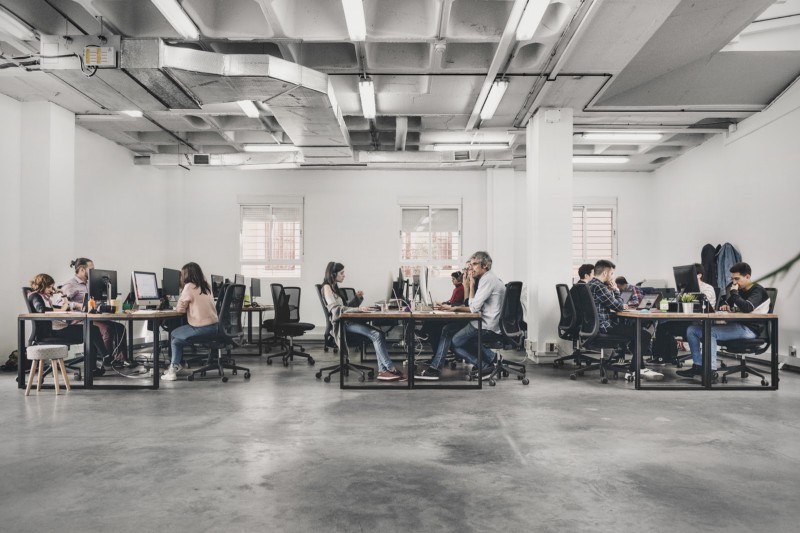

**During my last year of vocational training, Z1, an international digital product studio based in Sevilla, offered me the opportunity to join the Lab team as an intern. During the course of my internship, I’ve gotten to know the team and worked on really cool projects with them.**

I love the startup scene, I think it’s amazing how little companies show up in the market offering better products with far fewer people and resources than the big ones.

I’ve always had a few questions in my head regarding successful startups: How do they do it? How do they turn ideas into amazing products? Am I skilled enough to participate in the process?

These questions led me, back in November of 2018, to search for a startup in Seville to do an internship.

At the beginning of my research, I found myself lost in a sea of obsolete companies that didn’t fit with the idea of a startup I had in mind. The days were passing by, and I started to think I would end up in one of those companies at the bottom of an immense hierarchy working in projects that I didn’t find interesting.

That’s when one of my teachers mentioned Z1, which at the time was named Commite. The first thing that caught my eye was their website and the showcased products. Everything was beautiful and carefully crafted, they even listed the tech stack used for each project. After seeing all of that, the next thing I did was contact [Hector (Z1’s CEO) on LinkedIn](https://www.linkedin.com/in/hectorginer/).

### Joining the team

Six months later, in March of 2019, I joined the lab team of Z1 as an intern and began working with Ivan (Z1’s Lab Lead) in City Escape, a project that attempts to transform cities into escape rooms using augmented reality.

A few weeks later, Luis and Candido joined the internship program as a Full-Stack Developer and UX Designer respectively and since then, we’ve worked together in City Escape, the revamped version of How Much To Make An App that will launch soon, and a new tool that will allow people to build beautifully designed Gantt charts.

### Improving both hard and soft skills.

Z1 offers English classes so we can all practice speaking and at the same time we have interesting conversations with each other. I've been attending them since the second week, and I think it's really cool because, in addition to practicing English, you get to know your co-workers.

They even make a big deal about taking your picture so you can use it on Slack and other social media platforms. This is great because during the first month it was hard for me to associate names with faces, and thanks to this measure, everybody has a picture of themselves and every time I had doubts about someone's name I just had to take a look.

")

Another thing to highlight is the importance they give to socializing at the workplace by organizing events regularly. In the past three months, they’ve held a BBQ, a paella, some breakfasts, and the weekly event that takes place every Friday at 13:15, “San Litro y Papas.”

Overall, I’ve really enjoyed the experience of working at Z1, and I would recommend to anyone looking for an internship to contact this company as it would help them bootstrap their careers by improving both hard and soft skills.

---

At Z1, we are really active in social media, you’ll be able to find interesting resources and updates about what’s in the oven on [Twitter](https://twitter.com/z1digitalstudio), [LinkedIn](https://www.linkedin.com/company/z1digitalstudio/), [Instagram](https://www.instagram.com/z1digitalstudio/), [GitHub](https://github.com/z1digitalstudio), and [Dribbble](https://dribbble.com/z1).
